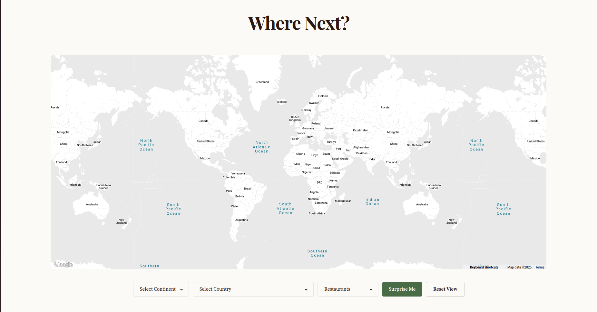
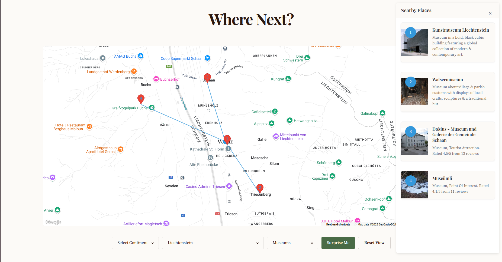
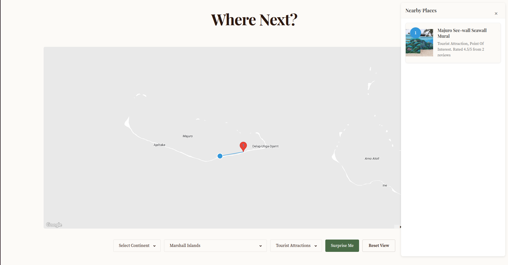

# Where Next?
Live demo : https://wherenext-beb6dfb541c8.herokuapp.com/

A weekend project I made, playing around with capabilities of Google Maps APIs (specifically, Places API, Geocoding API, and embed API in Javascript).

The website is a map-based travel exploration tool where you get suggested places to visit based on the place you select, with options such as:
1. Choosing a country
2. Choosing a continent
3. Choosing a place randomly. If #1 or #2 isnt selected, this can go anywhere in the world, but if you've previously selected a continent or country, then the random place is chosen from within those borders, so that you can selectively randomize
4. Just clicking anywhere on the map

Note: I tried to reduce it, but there are still chances that the unfiltered random leads to water bodies. The filtered random also tends to usually lead to places that are in the middle of nowhere/have very less data available on Google Maps.

Apart from geographical filters, you can also filter the places of interest, which apart from tourist attractions as default, can also be:
- Museums
- Art Galleries
- Movie Theaters
- Parks
- Campgrounds
- Zoos
- Restaurants
- Cafes
- Bars
- Shopping Malls
- Department Stores
- Casinos
- Night Clubs
- Amusement Parks
- Stadiums
- Churches
- Mosques
- Hindu Temples
- Synagogues

After a place is selected, a maximum of 4 spots nearby are shown, with a photo and a description of it. All of the data is pulled from google maps.

(Doesn't work for mobile screens)
